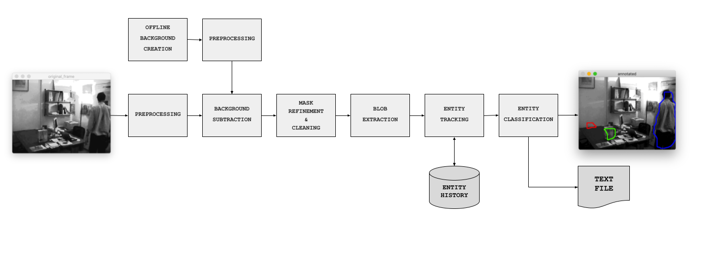
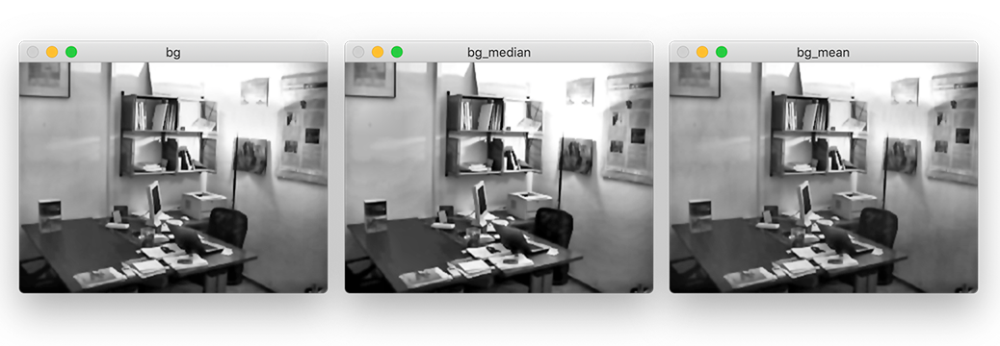
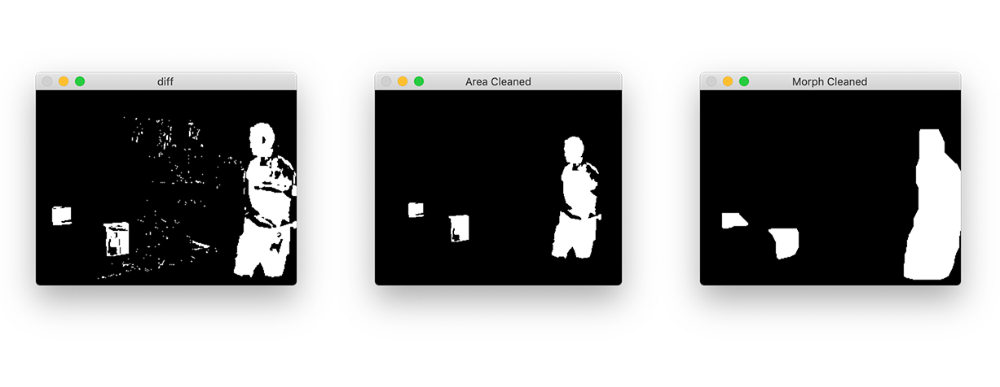
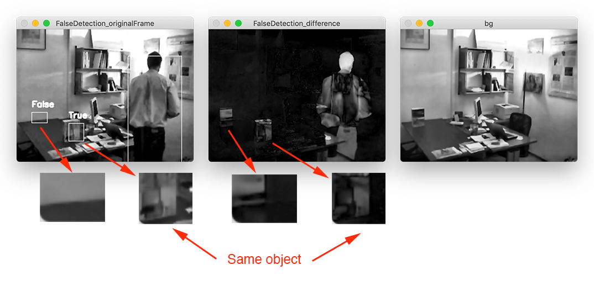

# Intrusion Detection System

Developement of a computer vision system aimed at intrusion detection as the UNIBO project course of Computer Vision and Image Processing M.

**Authors**: [Alessandro Fusco](MAILTO:alessandro.fusco3@studio.unibo.it) and [Ugo Leone Cavalcanti](MAILTO:ugoleone.cavalcanti@studio.unibo.it)

## Overview

This software system, based on automatic video analysis, can detect objects that do not belong to a static reference scene (_background_) and establish which of such objects are _persons_ or _other objects_.

In addiction, what has been identified as _other objects_ is then distinguished into either _false objects_ and _real objects_.

A _true object_, is an object abandoned by the subject, whilst a _false object_ is an object detected by the algorithm due to the removal of one _true object_ by the subject.

The system will provide the following outputs for each video frame:

- **Graphical Output**: labeled blobs or the labeled contours corresponding to detected objects (red for false object, green for true object, blue for person)
- **Text Output**: text file reporting the number of detected objects, the values of the associated blob features and the classification into either “person” or “other”

 <p align="center">
  
</p>

Text output sample:

| frame number | num object detected |                |             |               |               |              |                |
| ------------ | ------------------- | -------------- | ----------- | ------------- | ------------- | ------------ | -------------- |
| OBJECT ID    | BLOB AREA           | BLOB PERIMETER | BLOB ASPECT | BLOB CENTROID | BLOB BOUNDING | BLOB MOMENTS | CLASSIFICATION |

## Video Analysis Pipeline



### Definitions

We introduce a nomenclature in order to better explain our solution to this task; this nomenclature is reflected 1-to-1 in the classes of our implementation.
The software is structured in 4 main classes: `IntrusionDetection`, `Tracker`, `Entity` and `Blob`.

`IntrusionDetection` and `Tracker` are singletons that are used respectively to run the whole program and to keep track of the objects moving in the scene.
For the purposes of easier development and to follow common software engineering paradigms, we decided to semantically separate the concepts of `Entity` and `Blob`.

`Blob` is used to extract geometrical information of each single blob present in the mask, relative to a single frame. I.e, a Blob does not take into consideration the time factor; it is an immutable class.

An `Entity`, instead, is used to keep track of the evolution of a blob over time, by computing some frame-dependent property, such as speed.
We had to introduce this class, as object classification is not possible without making some frame-to-frame comparison assumptions.

Associating a newly detected `Blob` to a previously detected `Entity` is a responsibility of the `Tracker` class, and is performed by comparing the shapes and positions of current blobs and old ones.

### Offline Background Inizialization

First of all, it is necessary to compute the background. In order to do that, we choose a blind initialization technique.

From the input video sequence we generate a clean background considering a number of frames given by the param `--bgFrameCount`. Those frames are not taken consecutively, indeed a certain number of frames are skipped before caching another frame to generate the clean background. The number of frames to skip is given by the `--bgFrameSkip` parameter.

After that, the background is obtained as the result of the average of the median and the mean of the stored frames. In this way the background initialization is very robust against "fast" changes between the frames, but it is also able to achive quite good results with "slow" changes. This method is also quite balanced respect the differences in exposure between the frame series.

```python
cleanPlate = alpha * np.median(np.array(frames), axis=0).astype(np.uint8) + (1-alpha) * np.mean(np.array(frames), axis=0).astype(np.uint8)
```



### Frame Preprocessing

We first apply a bilateral filter to reduce high frequency noice.
We then apply a CLAHE histogram equalization to reduce the impact of lighting changes; we experimentally verified that CLAHE performs better than a classic histogram equalization.

### Background Subtraction

Having already preprocessed both the current frame and the background in this step we just calculate the absolute value of the pixel-wise difference between frame and background

```python
sub = np.subtract(cleanBG, frame)
abs = np.abs(sub)
```

Then applying a binary thresholding to the difference we got the initial mask.

### Mask Refinement & Cleaning

In this phase as first step we perform a small blob filtering, calculating the area of each blob found and delete those that have an area below a certain threshold. Then we perform a series of morphological operations (opening and closing) to clean and improve the shape of the blobs. If we did not do this step, in fact, the blobs would present many holes.

We also add some padding to the frame in order to avoid interference with the outer border of the image.



### Blob Extraction

By finding the contours in the mask we are able to detect all the blobs present in the frame; we can then procede to retrieve their main features (moment, area, perimeter, contour, etc).
These features allow us to compare them to other blobs.

## Entity Tracking

Entity tracking consists into associating the blobs extracted from the current frame to their actual entity.
This process iterates through all previously existing entities blobs and tries to find a match with the current ones.
This match is performed on the basis of a few geometrical assumptions, and is tuned to this particular instance of the problem.

One of the strongest assumptions we made, is the overlapping of subsequent blobs, controlled by the `intersection_threshold` parameter; this approach would not work with fast moving objects, where there could be no overlapping in subsequent frames.

`blob.similar(other_blob)` is the function in charge of detecting the temporal consistency of two blobs.
Two blobs are marked as _similar_ if **all** of the following conditions are met between two blobs:

- intersection area > `intersection_threshold`
- aspect difference < `aspect_threshold`
- extent < `extent_threshold`
- solidity < `solidity_threshold`

While this approach could seem computationally expensive, as it effectively is performed in a brute-force manner, sorting blobs by area may drastically reduce the search space as the blobs do not consistently change in terms of area.
When a match is found, we compute the shift in the position of the blob's centroid, i.e. it's speed.

If a match is not found, a new `Entity` is created, a unique ID is assigned to it and its speed is initialized to zero.

## Entity Classification

We based the classification between _person_, _false object_ and _true object_ upon an heuristic function.

### Person detection

The simple assumption that we made to differentiate a person from an object, is that a person is frequently moving.
We assign a positive score to a moving `Entity`, i.e. where its `|speed| > 1`, or a negative score otherwise.
It's important to notice that we cap the maximum and minimum score so that a person which starts moving, after standing still for a long time, will still be classified as a person.

Another approach that we thought about was to discriminate between objects and people by considering the blob's area.
We abandoned this approach as there aren't actual size constraints on the object sizes in the scene.

### False Object Detection

What has been identified as _other objects_ is then distinguished into _false objects_ and _real objects_.

An object, by our definitions, is identified by an area in the current frame that differ from the same area in the initialized background, but how to establish if this difference is due to an object removed or one added to the scene?

In order to achieve this distinction we observed that while the area demarcated by a blob is diferent in both the current frame and the background, that is not true between the current frame and the image resulted from the difference between the current frame and the background.



From these observations it follows that it is sufficient to compare the similarity between the part of the original frame corresponding to the object to be classified with the same area taken in the image that results from the difference with the background and the current frame. If the two sections are similar we can classify the object as _true_ otherwise we can say that it is _false_.

To compute this similarity we adopted the **structural similarity index measure** (SSIM).

To increase the stability of the classifier on the same object over consecutive frames we adopted a scoring system based on a heuristic.

## Usage

```bash
$ python3 main.py -h
usage: main.py [-h] [--input I] [--output O]

options:
  -h, --help  show this help message and exit
  --input I   The input video. default: the provided demo
  --output O  The output text file. default: ./output.txt
  --debug     Show background and additional information
```

## Requirements

This project is based on OpenCV and Scikit-Image, and is written in python3.

It is recommended to create a new virtual environment by running:

```bash
python3 -m venv .venv
source .venv/bin/activate
```

And install all the dependencies with

```bash
pip install -r requirements.txt
```

## Tuning

All of the parameters and thresholds used in this project are documented in the `tuning.py` file and changeable manually.
We report here the file in it's entirety, as it is self explainatory.

```python
hyperparams = {
    # Clahe filter parameters
    'clahe': {
        'clipLimit': 0,
        'tileGridSize': (1, 1)
    },

    # Frame preprocessing parameters
    'preprocessing': {
        # see more at cv2.bilateralFilter() documentation
        # https://docs.opencv.org/3.4/d4/d86/group__imgproc__filter.html#ga9d7064d478c95d60003cf839430737ed
        'd': 5,
        'sigmaColor': 50.0,
        'sigmaSpace': 50.0
    },

    # Background extraction parameters
    'bg_extraction': {
        # How many frames to use for creating the background?
        'frame_count': 60,
        # Take one frame every {frame_skip} frames to compute the background.
        'frame_skip': 1,

        # Blending parameter for mean-based and median-based backgrounds.
        'alpha': 0.5,
        # Filter out blobs that are smaller than 0.1% of the frame size, in terms of area.
        'area_thresh_perc': 0.001
    },

    # Background subtraction parameters
    'bg_subtraction': {
        # Level of intensity to which apply a threshold, in order to obtain a mask.
        'diff_threshold': 40.0,
    },

    # Mask refinement and cleaning parameters
    # See also kernels
    'mask_cleaning': {
        # How much padding to add to the mask before morphological operations
        'padding_size': 32,
    },

    # Entity classification parameters
    'tracking': {
        # Two blobs don't belong to the same entity if they overlap *less* than this number
        'intersection_threshold': 15.0,

        # Two blobs don't belong to the same entity if their aspect differs *more* than this.
        'aspect_threshold': 1.9,

        # Two blobs don't belong to the same entity if their extent differs *more* than this.
        'extent_threshold': 0.25,

        # Two blobs don't belong to the same entity if their solidity differs *more* than this.
        'solidity_threshold': 0.2,
    },
}


```
